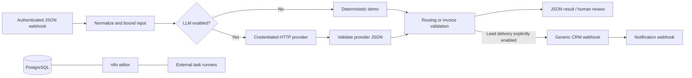

# n8n AI Automation Starter

Automate repetitive business workflows with self-hosted n8n. Qualify incoming leads, prepare customer email replies for staff review, and validate invoice data before it enters another system.

This starter is for small businesses and freelancers who want visible, editable workflows without committing to one CRM or AI vendor. Three importable workflows and fictional examples are included. Run their deterministic business logic immediately with Node.js, or start n8n with PostgreSQL and import the visual workflows. Demo mode makes no external requests and needs no paid API.

## What you can run

| Workflow | Input | Result |
| --- | --- | --- |
| Lead qualification | Contact details, company size, budget, request | Category, score, priority, summary, next action, CRM payload, notification preview |
| Customer email triage | Sender, subject, message | Sales/support/billing/spam/other classification, summary, draft, mandatory human review |
| Invoice extraction | Structured invoice in demo; document text with optional LLM | Normalized fields, line items, arithmetic and completeness warnings |

The demo classifier uses transparent rules. It is not an AI model. The optional HTTP branch supports OpenAI-compatible chat providers and validates their JSON before downstream processing.

## Quick start without Docker

Requires Node.js 22 or later. There are no npm dependencies.

```sh
node scripts/demo.mjs lead-qualification examples/lead.json
node scripts/demo.mjs email-triage examples/email.json
node scripts/demo.mjs invoice-extraction examples/invoice.json
npm test
npm run check
```

These commands execute the exported Code node logic. They do not emulate n8n's scheduler, HTTP nodes, or authentication. In PowerShell with restricted script execution, use `npm.cmd test` and `npm.cmd run check`, or run `node --test` and `node scripts/check-workflows.mjs` directly.

## Start n8n

Requires Docker Engine/Desktop with Docker Compose v2. The Compose file pins n8n and task runners to the same version. Review upstream security updates before public deployment.

```sh
cp .env.example .env
# Generate three independent values, then paste one into each empty required field.
node -e "console.log(require('node:crypto').randomBytes(32).toString('hex'))"
# Repeat for POSTGRES_PASSWORD, N8N_ENCRYPTION_KEY, and N8N_RUNNERS_AUTH_TOKEN.
docker compose config --quiet
docker compose up -d
docker compose ps
```

On PowerShell, use `Copy-Item .env.example .env` instead of `cp`. Missing required values stop Compose. Open **http://localhost:5678**, create the n8n owner account, and use a strong unique password. The owner account protects the editor; webhook authentication is configured separately. PostgreSQL and the runner broker have no host ports. Only the editor's loopback port is exposed.

## Import and run the workflows

1. In n8n, choose **Import from File** and import each file from `workflows/`.
2. Create a **Header Auth** credential with header name `X-Workflow-Token` and an independently generated random value. Assign it to the **Incoming webhook** node in each workflow. No working credential is bundled.
3. Keep `llm_enabled` and `delivery_enabled` false in **Normalize input** for demo mode.
4. Select **Listen for test event** in the Webhook node. POST one example to the test URL. Each test listener accepts an event while the editor is listening.
5. Review the returned JSON and the visual execution. Publish/activate the workflow when ready to use its production URL. Exported workflows are inactive.

Examples below use a shell variable containing your own local webhook token. Do not commit it. On PowerShell use `curl.exe` and `$env:WORKFLOW_TOKEN`.

```sh
curl -X POST http://localhost:5678/webhook-test/lead-qualification \
  -H "X-Workflow-Token: $WORKFLOW_TOKEN" -H 'Content-Type: application/json' \
  --data-binary @examples/lead.json
curl -X POST http://localhost:5678/webhook-test/email-triage \
  -H "X-Workflow-Token: $WORKFLOW_TOKEN" -H 'Content-Type: application/json' \
  --data-binary @examples/email.json
curl -X POST http://localhost:5678/webhook-test/invoice-extraction \
  -H "X-Workflow-Token: $WORKFLOW_TOKEN" -H 'Content-Type: application/json' \
  --data-binary @examples/invoice.json
```

Production URLs use `/webhook/` instead of `/webhook-test/`. Invalid input fails the execution and must not be treated as an accepted delivery. These examples return JSON for valid requests; n8n controls the platform error response for failed Code nodes.

## Architecture



PostgreSQL persists n8n configuration and workflow metadata. Named volumes persist database data and n8n encryption-related files. External task runners execute Code nodes separately from the n8n process. The runner and main images must remain on identical versions.

## Enable a real LLM

See [provider setup](docs/integrations.md#llm-provider). The exported workflows already contain the HTTP branch, structured-output prompt, timeout, and response validation. Add a Header Auth credential to **LLM extraction**, choose a model and trusted endpoint in **Normalize input**, and set `llm_enabled` true. Do not put provider keys inside workflow JSON.

An OpenAI-compatible service must implement `POST /v1/chat/completions`, JSON output mode, and the `choices[0].message.content` response. A local compatible model server can avoid paid APIs; verify its schema support. Other APIs require an adapter node. Demo classification is deliberately simple, while provider output may be wrong and requires business review.

For invoice free text, submit `{"invoice": {}, "text": "Invoice ..."}` with LLM mode enabled. Demo mode only normalizes structured invoice data. This repository does not extract PDF text or perform OCR; use a document extraction service upstream.

## Connect business systems

[Integration notes](docs/integrations.md) cover generic CRM webhooks, HubSpot, Pipedrive, Salesforce, Airtable, email services, and Slack-like notifications. Keep destinations configured by an administrator; never accept a destination URL from the webhook payload.

Lead demo mode returns delivery previews. The live path sends the CRM payload, then a notification, only after `delivery_enabled` is explicitly set. Email triage never sends email: every draft goes to a human review queue. Invoice output can be connected to a credentialed HTTP or database node after validation; block saving when `validation.valid` is false.

## Security and production deployment

- Put HTTPS and request rate limits in front of n8n. Keep the editor private through a VPN or identity-aware proxy. Set `N8N_PROTOCOL=https`, real editor/webhook URLs, and `N8N_SECURE_COOKIE=true` for HTTPS. Configure trusted proxy hops to match your actual reverse proxy.
- Use unique owner credentials and independent webhook/provider credentials. Rotate tokens, enforce least privilege, and keep `.env` out of Git. The encryption key must survive restore; losing it can make credentials unreadable.
- The local HTTP/cookie configuration is restricted to loopback and is not a public deployment configuration.
- Environment access from nodes is blocked. Manage integrations in n8n's encrypted credential store or a supported secret manager. Do not enable arbitrary module imports or untrusted community nodes.
- The global webhook payload limit is 1 MiB; individual text fields and invoice line count are bounded. Add per-client rate limits, replay protection, and idempotency keys at a gateway for production. The demo does not implement global delivery deduplication.
- Execution result retention is disabled by default, including manual executions. Data can still appear temporarily in the editor and upstream service logs; limit access and review provider retention/data residency for privacy obligations.
- Outbound HTTP requests have a 20-second timeout; workflows have a 60-second deadline. Do not enable automatic delivery retries until the receiving system supports idempotency. A notification failure can occur after the CRM accepted the lead.
- Restrict container egress to trusted providers and business systems. Do not expose PostgreSQL or the runner broker publicly. Configure TLS for remote database connections if separating services.

See [operations and backups](docs/operations.md) for deployment checks, backups, restore, and safe shutdown. `docker compose down` retains named volumes; never use `down -v` to upgrade.

## Testing and validation

```sh
npm test
npm run check
docker compose config --quiet
```

Unit tests execute the actual workflow Code node strings. They cover routing, rejection of bad input, every email category, mandatory review, invoice reconciliation, missing amounts, invalid dates, and malformed model output. The structural check verifies JSON formatting, graph references, inactive exports, and webhook authentication. The CI workflow is configured to run these checks and validate Compose with fake CI-only variables; it has not run on hosted GitHub infrastructure yet.

Local QA passed 22 business/provider tests, the workflow structural check, and `docker compose config --quiet` using Compose CLI v5.5.1. Provider contracts were tested with mocks. Docker Engine was unavailable, so images were not built, containers were not started, and PostgreSQL runtime and n8n startup/import were not tested end-to-end. No live LLM or external CRM, email, or notification accounts were used.

These are not full n8n integration tests. After importing, test all three webhooks with credentials, the runner connection, and your chosen integrations before deployment. No workflow screenshot is included; capture the imported canvas and a successful execution once the stack is running.

## Limitations

- Demo lead/email scoring is rule-based and should be tuned for a client's business. Demo invoices need structured input.
- Currency is validated as a three-letter shape; it is not checked against the complete ISO currency registry. Arithmetic uses two-decimal rounding, so currencies with different minor units need customization.
- Invoice line totals are pre-tax totals; tax is separate. This convention must match the upstream parser. Unknown fields remain null and produce warnings where applicable.
- The live LLM branch trusts only a configured endpoint but cannot guarantee factual accuracy. Human oversight remains necessary.
- No CRM-specific mapping, outbound email, OCR, approval dashboard, proxy, virus scanner, delivery queue, or enterprise access management is bundled.
- This starter uses n8n's upstream software under its own license. The workflow examples and repository files are MIT-licensed; this does not relicense n8n. Review [n8n licensing](https://github.com/n8n-io/n8n/blob/master/LICENSE.md) before offering hosted services.

## Customization / Freelance

Need something similar for your business?

I build custom AI automation, backend systems, API integrations, and workflow automation.

I can customize these workflows for your CRM, email, APIs, databases, and internal tools.

Email: [work@bububi.icu](mailto:work@bububi.icu)  
Telegram: [@o3amfeels](https://t.me/o3amfeels)  
GitHub: [@shipap](https://github.com/shipap)

Built by Alexander — AI Automation & Backend Developer.
